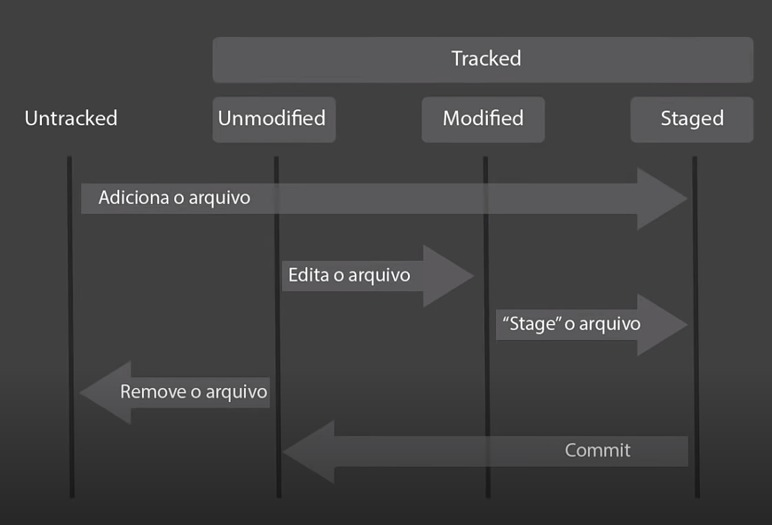
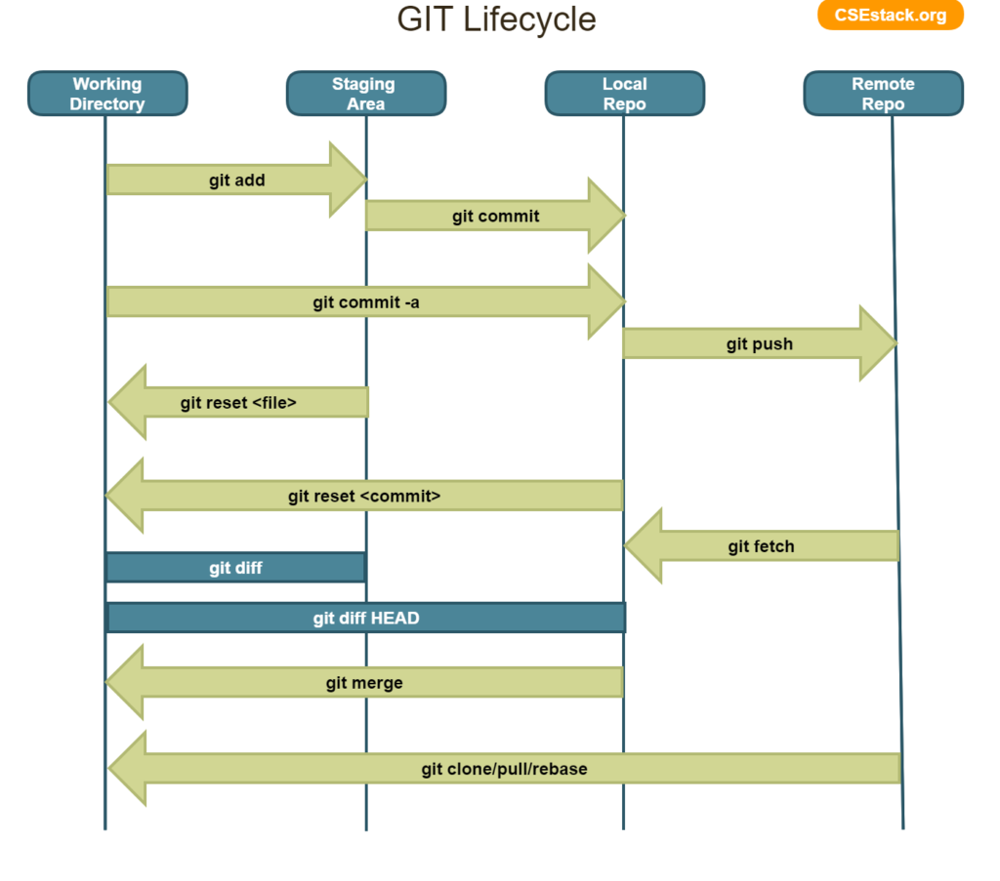

# Ciclo de Vida

O Git possui um ciclo de vida bem definido que guia sua operação.  
Através do ciclo de vida cada usuário poderá gerenciar seus arquivos e versionamento.  
Para gerenciar o ciclo de vida no Git utilizam-se os comandos da ferramenta CLI.  

 

### **Ciclo de vida e os estágios dos arquivos**
----
O ciclo de vida dos arquivos no Git traz os seguintes estágios: 
1. **Untracked**
    - Quando o arquivo não está monitorado pelo Git
2. **Tracked**
    - Quando o arquivo está monitorado pelo Git
    - Neste caso ele pode estar em 3 diferentes estágios:
        1. Unmodified - Está monitorado e sem modificações (tudo salvo no controle de versões)
        2. Modified - Está monitorado mas tem alterações ainda não salvas
        3. Staged - Está monitorado e na área de transferência para salvar alterações

 

### **Ciclo de vida - comandos e locais**
----
Ao utilizar os comandos do Git, manipulamos o estágio dos arquivos no ciclo de vida e movimentamos eles dentro dos locais do Git.  
A imagem abaixo demonstra cada comando e como ele movimenta os arquivos dentro dos locais no Git.

 

